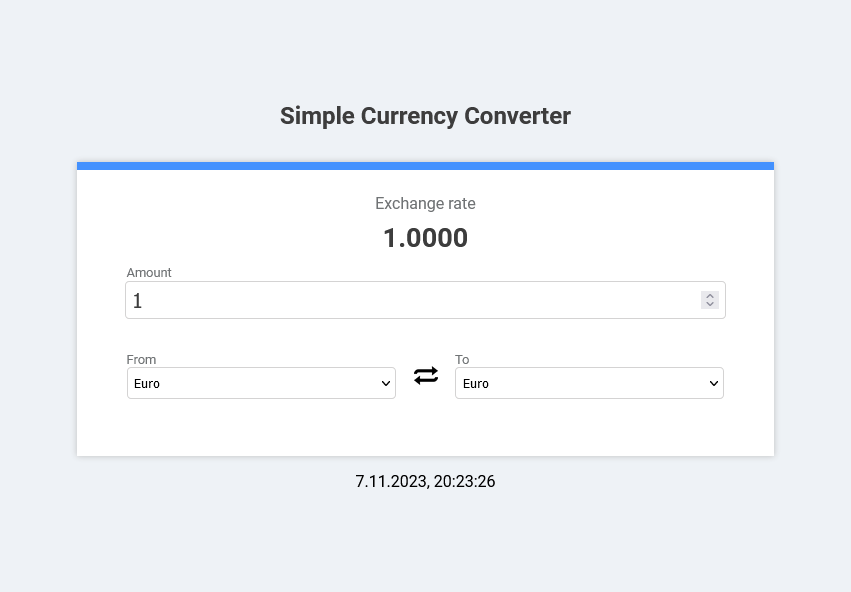

# Simple currency converter

Currency converter written in JS with React library. Used this [API](https://www.exchangerate-api.com/).



## Features

-   Ability to select the currency to convert from/to for conversion (with a drop-down list).
-   Currencies codes (e.g. EUR) are mapped to their proper names.
-   Ability to type into input field amount of currency for conversion (decimal and float numbers greater or equal 1 only. Step = 0.01)
-   Real-time date and time (language-sensitive representation).
-   A button for swapping selected currencies.
-   An activity indicator, which runs every time data is fetched from API.

## Getting Started

To run the React Currency Converter on your local machine, follow these steps:

1. Clone the repository to your local machine using the following command:

```
git clone https://github.com/Aleks334/currency-converter
```

2. Navigate to the project directory:

```
cd currency-converter
```

3. Install the required dependencies:

```
npm i
```

4. Run the development server (Vite):

```
npm run dev
```
